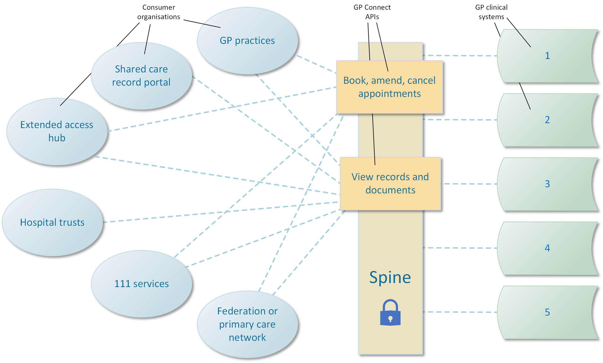
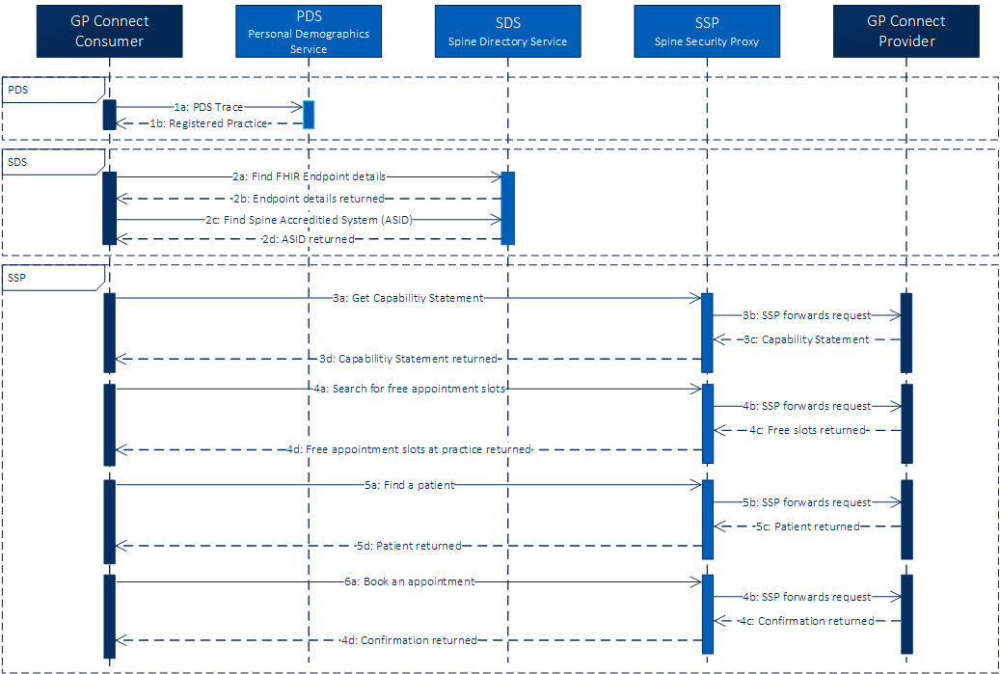




{:target="_blank" class="no_icon"} {:target="_blank" class="no_icon"} 


## The GP Connect vision ##

GP Connect aims to support better clinical care by opening up information and data held within GP practice IT systems for use across health and social care. The GP Connect vision will be achieved by standardising integration and simplifying the operating model.

GP Connect allows users in a variety of care settings to access information from approved clinical systems using standard APIs, which are integrated with the [NHS Spine](https://digital.nhs.uk/services/spine).

Find out more on the [NHS Digital GP Connect homepage](https://digital.nhs.uk/services/gp-connect).

## Audience ##
The content here is designed for consumer suppliers and provider suppliers:
&nbsp;
**Consumer suppliers**
*	you're a software development company already working with the NHS or would like to work with the NHS
*	you want to use GP Connect to develop a product that consumes GP data
* you intend to work with a suitable end-user organisation, which you may or may not have already identified

See [Getting started for consumer suppliers](overview_getting_started_consumers.html)
&nbsp;
**Provider suppliers**
*	you're a GP clinical system supplier or are working with the NHS to become one
*	you want to use GP Connect to enable other systems to access GP data on your system for direct patient care

See [Getting started for provider suppliers](overview_getting_started_providers.html)

## About the FHIR&reg; API specifications ##

In partnership with GP clinical system suppliers, GP Connect has developed a set of FHIR&reg; API specifications that make data from different clinical systems available to clinicians when and where they need it. GP Connect supports the development of products that use the data made available by the APIs for *direct care purposes*.

Each specification has a dual objective:
 
* to show consumer suppliers how to develop APIs for their applications so they can access clinical data
* to show provider suppliers how to develop APIs for their systems so they can share their clinical data

The specifications are arranged by [version number](design_product_versioning.html) and grouped into separate [capabilities](overview_priority_capabilities.html). To find out about other specifications, visit the [Specification directory](https://digital.nhs.uk/services/gp-connect/gp-connect-specifications-for-developers).

## Provide feedback ##
To provide feedback on the GP Connect specification please send an email to the [GP Connect Team Inbox](mailto://gpconnect@nhs.net).




