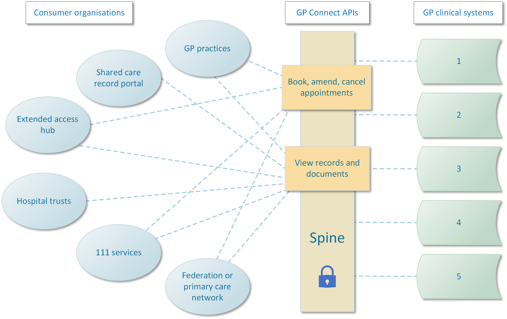




{:target="_blank" class="no_icon"} {:target="_blank" class="no_icon"} 


## The GP Connect vision ##

GP Connect aims to support better clinical care by opening up information and data held within GP practice IT systems for use across health and social care. The GP Connect vision will be achieved by standardising integration and simplifying the operating model.

                                                                                                                                                     
                                                                                                                                                    
In partnership with GP clinical system suppliers and other key parties, GP Connect has developed a set of FHIR&reg; API specifications that make data from different clinical systems available to clinicians when and where they need it. GP Connect supports the development of products that use the data made available by the APIs for *direct care purposes*.

## Audience ##
The GP Connect specifications are designed for:

* Consumer suppliers - developers of applications that use GP Connect FHIR® APIs – for example, a system supplier in an acute or mental health care setting. See [Getting started for consumer suppliers](overview_getting_started_consumers.html).
* Provider suppliers - suppliers of GP clinical systems that provide data through the GP Connect FHIR® APIs. See [Getting started for provider suppliers](overview_getting_started_providers.html).

## Specifications ##
Each specification has a dual objective:
 
* to show consumer suppliers how to develop APIs for their applications so they can access clinical data
* to show provider suppliers how to develop APIs for their systems so they can share their clinical data

The specifications are arranged by [version number](design_product_versioning.html) and grouped into separate [capabilities](overview_priority_capabilities.html). To find out about other specifications, visit the [Specification directory](https://digital.nhs.uk/services/gp-connect/gp-connect-specifications-for-developers).

## Provide feedback ##
To provide feedback on the GP Connect specification please send an email to the [GP Connect Team Inbox](mailto://gpconnect@nhs.net).




