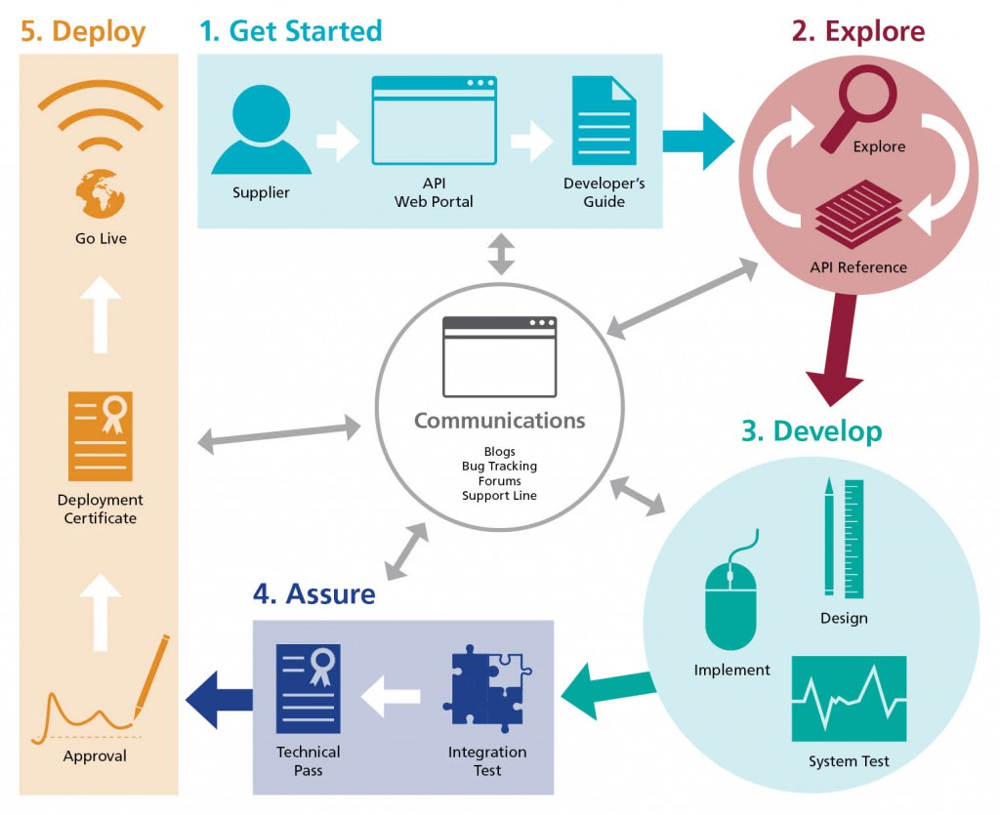





# The GP Connect Vision #

GP Connect aims to support better clinical care by opening up information and data held within GP Practice IT systems for use across health and social care. The GP Connect vision will be achieved by standardising integration and simplifying the operating model.

Find out more on the [NHS Digital GP Connect homepage](http://systems.digital.nhs.uk/gpsoc/interface/gpconnect).

# The GP Connect Developer Ecosystem #

This site is broadly structured around a typical API Developer's Journey:

To begin head to the [Getting Started](overview_engage.html) page.

