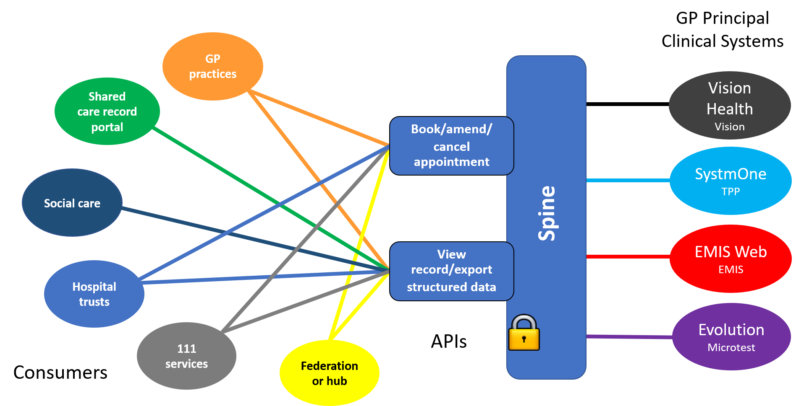


{:target="_blank" class="no_icon"} {:target="_blank" class="no_icon"} 


GP Connect is a service that can allow authorised clinical staff in GP practices and other care settings to share GP practice clinical information and data between IT systems, quickly and efficiently. This ensures patient medical information is available to clinicians when and where they need it, improving patient care.

GP Connect is developing standardised  specifications to be used by any system for the sharing of data, so that clinicians in different care settings can:

* view a patient’s GP practice record
* import or download medication and allergies information from this record 
*	manage a patient's GP appointments

This will provide better, safer, more convenient care for patients and save time for clinicians. It will also help meet targets under [NHS England’s improving access to general practice programme](https://www.england.nhs.uk/gp/gpfv/redesign/improving-access/).

## GP Connect overview ##

## GP Connect APIs and capabilities ##
The APIs are grouped into sets, known as 'capabilities', which enable specific business functionality. GP Connect has worked with GP clinical system suppliers to deliver the following capabilities:

*	Access Record HTML – enables clinicians to view a patient’s medical record
*	Appointment Management – enables clinical staff to book, amend or cancel an appointment for a patient
*	Access Record Structured – enables an export of a patient’s medications and allergies 

[Find out more about the capabilities](/overview_priority_capabilities.html)

# Using this guide #

This guide has been created to support the adoption of Care Connect profiles and FHIR resources. As such the site is structured around Care Connect stakeholders including API users, developers and architects.  



The above steps outline a complete API journey from imagination and exploring to developing local APIs using Care Connect profiles all the way to deploying a live API.

## Pilot using the GP Connect APIs ##
The GP Connect programme is now supporting the development of systems that connect with the APIs to use data from patient records and appointment schedulers for patient care by integrating it or importing it into local clinical systems.

We’re working with selected partnerships of health and care organisations and software suppliers. Partnerships will use the APIs to develop technical solutions to local issues with sharing patient records and appointment booking across system boundaries.
We’ve developed a process called ‘First of Type’ to support this development and provide assurance for these early products.

[Getting involved with GP Connect](https://digital.nhs.uk/services/gp-connect)

## Community engagement ##
GP Connect is working closely with [INTEROPen](http://www.interopen.org/){:target="_blank"}, a healthcare IT interoperability community of suppliers, NHS organisations and healthcare standards bodies in the UK.

## Customer types ##
GP Connect has identified three main customer types:
 
* 
  
*	
  
*	
  

## Provide feedback ##
To provide feedback on the GP Connect specification please send an email to the [GP Connect Team Inbox](mailto://gpconnect@nhs.net).





## Next step ##
[Getting started](/overview_engage.html)
